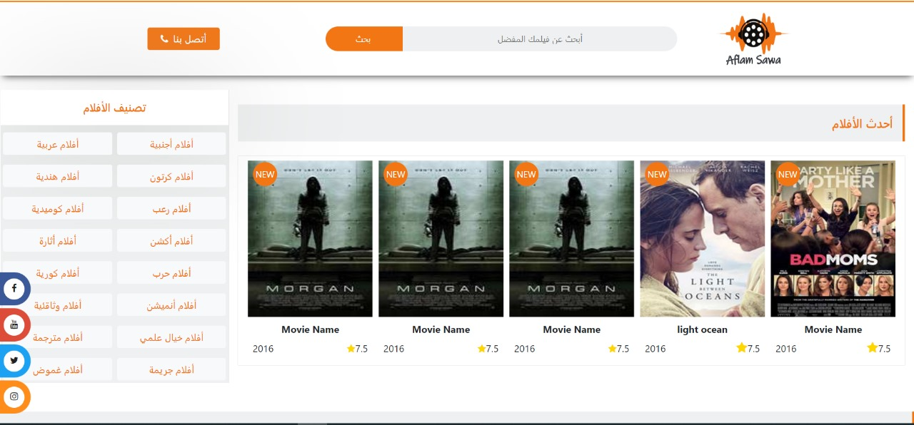

# Movie Landing Page 🎬

A **Movie Landing Page** built using **HTML, CSS, and JavaScript**, showcasing a wide collection of movies in an interactive and visually appealing interface.

## 🌟 Features

- **Latest Movies Carousel:** Display the newest movies using Owl Carousel.  
- **All Movies Section:** Browse all available movies.  
- **Top-Rated & Most-Viewed & Featured Movies:** Highlight the movies with the highest ratings , views and features.
- **Movie Search:** Search for any movie by title.  
- **Categories:** Filter movies by genres like Action, Cartoon, Comedy, etc.  
- **Contact Links:** A "Contact Us" section for user inquiries.

## 🛠️ Technologies Used

- **HTML5**  
- **CSS3**  
- **JavaScript**  
- **Bootstrap** for responsive design and components  
- **jQuery** for DOM manipulation and Owl Carousel  
- **FontAwesome** for icons

## 📸 Screenshots

| Landing Page |
|-------------|-----------------------|
|  


## 🚀 How to Run

1. Clone the repository:
```bash
git clone https://github.com/SSamoel/LeonHtmlCSSTemplate.git

2ز


